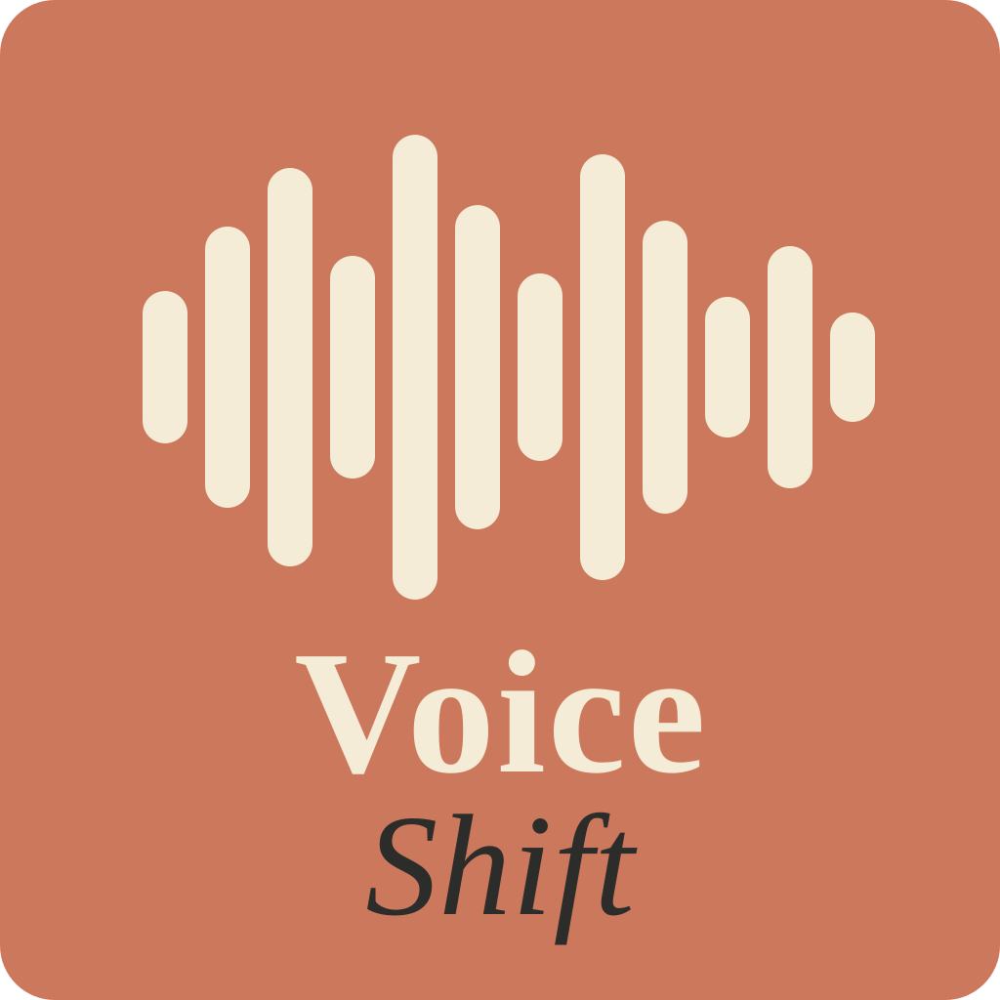

# VoiceShift

Lokale Speech-to-Text + Text-Einfüge-App für macOS (Apple Silicon M1)

<p align="left">
  
</p>

## Schnellstart

```bash
# 1. Setup (einmalig, ~5 Minuten)
chmod +x scripts/setup.sh
./scripts/setup.sh

# 2. App starten
python3 src/app.py
```

## Hotkey

| Aktion | Tastenkombination |
|--------|-------------------|
| Aufnahme starten | Ctrl + Shift (halten) |
| Aufnahme stoppen | Loslassen |

## Auto-Start beim Login

Ein LaunchAgent unter `~/Library/LaunchAgents/com.voiceshift.app.plist` startet
die App automatisch beim Login. Nach Crash wird sie automatisch neu gestartet
(Throttle 30 s). Bei normalem Beenden über das Menü (Cmd+Q) bleibt sie aus.

```bash
# Manuell laden
launchctl load -w ~/Library/LaunchAgents/com.voiceshift.app.plist

# Stoppen
launchctl unload ~/Library/LaunchAgents/com.voiceshift.app.plist

# Status
launchctl list | grep voiceshift

# Logs live verfolgen (/tmp wird bei jedem Neustart geleert)
tail -f /tmp/voiceshift.out.log

# Dauerhafte Logs mit Uhrzeit (überleben Neustarts, rotiert bei 5 MB)
tail -f ~/.voiceshift/logs/voiceshift.log
```

## Benötigte Berechtigungen

1. **Mikrofon** → Systemeinstellungen > Datenschutz > Mikrofon
2. **Bedienungshilfen** → Systemeinstellungen > Datenschutz > Bedienungshilfen

Beim ersten Start öffnet sich ein Onboarding-Fenster mit genauen Anweisungen.

## Projektstruktur

```
voiceshift/
├── assets/
│   ├── logo.svg              # Vektor-Logo (Quelle für Icon)
│   ├── icon.icns             # macOS App-Icon (alle Größen)
│   ├── icon_menubar.png      # Kleines PNG für die Menüleiste
│   └── icon.iconset/         # Einzelne PNG-Größen
├── scripts/
│   └── setup.sh              # Einmaliges Setup (Homebrew, whisper.cpp, Modell)
├── src/
│   ├── app.py                # Einstiegspunkt
│   ├── menu_bar.py           # macOS Menüleisten-App (rumps)
│   ├── recorder.py           # Mikrofon-Aufnahme (sounddevice)
│   ├── transcriber.py        # Whisper.cpp Integration
│   ├── injector.py           # Text-Einfügung via Accessibility API
│   ├── hotkey.py             # Globaler Ctrl+Shift Hotkey (Quartz)
│   ├── permissions.py        # Berechtigungs-Check
│   └── onboarding.py         # Onboarding-Fenster (4 Schritte)
└── README.md
```

## Datenverzeichnis

Modell, whisper.cpp-Binary und Onboarding-Flag liegen unter `~/.voiceshift/`:

```
~/.voiceshift/
├── whisper.cpp/              # Kompiliertes whisper.cpp (~1 GB)
├── models/ggml-small.bin     # Whisper-Modell (~466 MB)
├── recordings/               # Laufende/unerledigte Aufnahmen (werden beim Start nachgeholt)
│   └── failed/               # Aufnahmen, deren Transkription scheiterte
├── logs/                     # voiceshift.log + hang-*.txt (Thread-Stacks bei Audio-Hängern)
└── .onboarding_done          # Marker dass Onboarding gesehen wurde
```

## Phase 2 – KI-Transformationen

Geplant: Claude API für Modi Formell / Übersetzen / Struktur
Datei: `src/transformer.py` (noch nicht implementiert)
